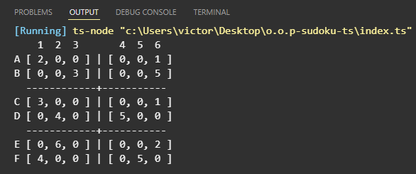

# Matriz Sudoku - P.O.O



Este projeto foi desenvolvido como objetivo de estudos em POO e TypeScript. Ele cria a matriz de um jogo Sudoku utilizando conceitos POO com 3 classes para o funcionamento, sendo elas:

 - Block: A classe que cria e autentifica dois arrays com 2 números aleatórios de 1 a 6 inseridos em cada um deles, sem repetição. Esses arrays funcionam como os 'blocos' 3x2 do minigame.

 - Sudoku: A classe que faz Associação por Composição na classe 'Block' e gera 6 desses blocos.

 - Game: A class que faz Associação por Composição na class 'Sudoku' e lida com todo o terminal e prompts do usuário.

Este projeto utiliza os padrões de projeto Singlton e Factory Method, encontrado em GoF.

# File Tree:


``` tree
    o.o.p-sudoku-ts/
    ├─ class/
    │  ├─ Block.ts
    │  └─ Sudoku.ts
    ├─ vscode/
    │  └─ settings.json
    ├─ .gitignore
    ├─ index.ts
    ├─ package-lock.json
    ├─ package.json
    ├─ README.md
    └─ tsconfig.json
```

# Modo de Iniciação:

``` bash
    git clone https://github.com/victorfreire7/o.o.p-sudoku-ts.git
```

``` bash
    npm install 
```

``` bash
    npm run start 
```

# Dependências:

``` json

  "dependencies": {
    "prompt-sync": "^4.2.0",
    "typescript": "^5.9.3"
  },
  "devDependencies": {
    "@types/node": "^25.2.3",
    "@types/prompt-sync": "^4.2.3"
  }
```
